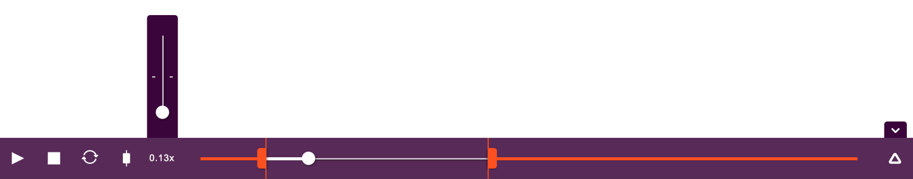

# @mojs/player – [](https://www.npmjs.com/package/@mojs/player)

GUI player to control your animations.



Player controls for [mojs](https://github.com/mojs/mojs). Intended to help you to craft `mojs` animation sequences. To be clear, this player is not needed to play `mojs` animations. It is just a debug tool that gives you the ability to:
- control your sequences with `GUI` while working on them
- it saves the current progress of your animation thus you don't loose the `focus`
- it gives you `bounds` to constrain `focus point` of your animation
- it gives you the control over the speed of animation
- it gives you the ability to seek animations freely
- it saves player's state and settings thus they not get lost when page reloaded

## Installation

The `MojsPlayer` depends on `mojs >= 0.225.2` so make sure you link it first.

```console
# cdn
<script src="https://cdn.jsdelivr.net/npm/@mojs/player"></script>

# npm
npm i @mojs/player
```

Import `MojsPlayer` constructor to your code, depending on your environment:

```javascript
const MojsPlayer = require('mojs-player').default;

// or
import MojsPlayer from '@mojs/player';
```

> If you installed it with script link — you should have `MojsPlayer` global

## Usage

Construct `MojsPlayer` and pass your main `Tween/Timeline` to the `add` option:

```javascript
// create the timeline
const mainTimeline = new mojs.Timeline({});

// add the timeline to the player
const mojsPlayer = new MojsPlayer({
  add: mainTimeline
});
```

> The `add` option is the **only required option** to launch: player's controls should appear at the bottom of the page when ready

You can also set other player initial state:

```javascript
const mojsPlayer = new MojsPlayer({

  // required
  add:          mainTimeline,

  // optionally
  className:    '',         // class name to add to main HTMLElement
  isSaveState:  true,       // determines if should preserve state on page reload
  isPlaying:    false,      // playback state
  progress:     0,          // initial progress
  isRepeat:     false,      // determines if it should repeat after completion
  isBounds:     false,      // determines if it should have bounds
  leftBound:    0,          // left bound position  [0...1]
  rightBound:   1,          // right bound position [0...1]
  isSpeed:      false,      // determines if speed control should be open
  speed:        1,          // `speed` value
  isHidden:     false,      // determines if the player should be hidden
  precision:    0.1,        // step size for player handle - for instance, after page reload - player should restore timeline progress - the whole timeline will be updated incrementally with the `precision` step size until the progress will be met.
  name:         'mojs-player', // name for the player - mainly used for localstorage identifier, use to distinguish between multiple local players
  onToggleHide(isHidden) {  // should be called after user taps on the hide-button (isHidden is a boolean, indicating the visibility state of the player)
    if (isHidden) {
      // do something when player is invisible
    } else {
      // do something when player is visible
    }
  }
});
```

## Shortcuts

- `alt + p`  - toggle `play`/`pause` playback state
- `alt + - `  - decrease progress by `1/100`
- `alt + +` - increase progress by `1/100`
- `shift + alt + -` - decrease progress by `1/10`
- `shift + alt + +` - increase progress by `1/10`
- `alt + s` - `stop` playback
- `alt + r` - toggle `repeat` state
- `alt + b` - toggle `bounds` state
- `alt + h` - toggle `show`/`hide` player state
- `alt + q` - reset `speed` to `1x`
- `alt + 2` - decrease `speed` by `1/50`
- `alt + 3` - increase `speed` by `1/50`
- `shift + alt + 2` - decrease `speed` by `1/10`
- `shift + alt + 3` - increase `speed` by `1/10`


## Development

Install [webpack](https://webpack.github.io/) globally:

```console
[sudo] npm install webpack -g
```

Install dependencies with [npm](https://www.npmjs.com/):

```console
[sudo] npm install
```

Run [webpack](https://webpack.github.io/):

```console
webpack
```

Please make sure you are on the `dev` branch before making changes.
